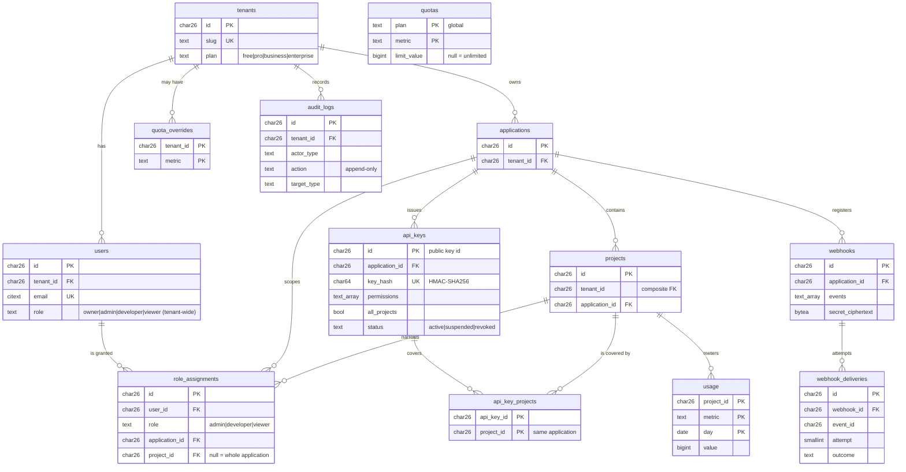
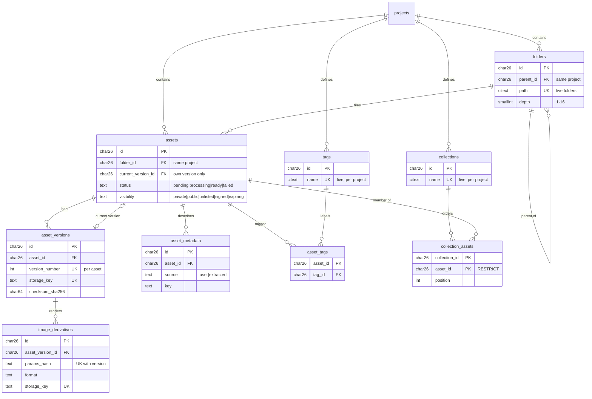

# 01 - Entity Relationship Diagram

> Category: **Database** (`docs/DATABASE/`) &nbsp;|&nbsp; Status: Final (v1 -- grows with each schema task) &nbsp;|&nbsp; Owner: TBD

## Purpose

A diagram of the tables that **exist** -- not the ones planned. Every
migration that adds a table updates this document in the same change.
Columns are abridged to keys and the fields that explain a relationship; the
exact definitions are the generated blocks in each table's document
(`02`-`17`).

## Category Mandate

The relational data model underlying assets, tenancy, permissions, usage,
and audit.

---

## Current schema (after `P1-01`)

### Tenancy and access

### Assets

Every table also carries `tenant_id` (and, if project-owned, `project_id`);
they are omitted above for readability and are part of every composite FK.

## Constraints worth seeing

| Constraint | Meaning |
|---|---|
| `*_id_tenant_uk unique (id, tenant_id)` | Target for composite FKs from tenant-owned children |
| `*_id_project_tenant_uk unique (id, project_id, tenant_id)` | Target for FKs between project-owned rows: same project enforced |
| `projects_id_application_tenant_uk` | Lets `api_key_projects`, `role_assignments` and `usage` prove a project is in a given application |
| `assets_current_version_fk (current_version_id, id, ...) -> asset_versions (id, asset_id, ...)` | The pointer names this asset's own version |
| `image_derivatives_identity_uk (tenant_id, project_id, asset_version_id, params_hash)` | One derivative per version and transformation (ADR-004) |
| `collection_assets_asset_fk ... on delete restrict` | An asset in a collection cannot be purged |
| `audit_logs_guard` trigger | UPDATE never; DELETE/TRUNCATE only in the retention purge |

## Acceptance Criteria

- [x] Reflects exactly the tables the migrations create (the migration
      lint's table list and the generated blocks are the check).

## Related Documents

- `docs/DATABASE/00-DATA-MODEL.md`, `02`-`18`
- `packages/db/src/migrations/`
- `MEMORY/DECISIONS.md` (`ADR-005`, `ADR-022`)
