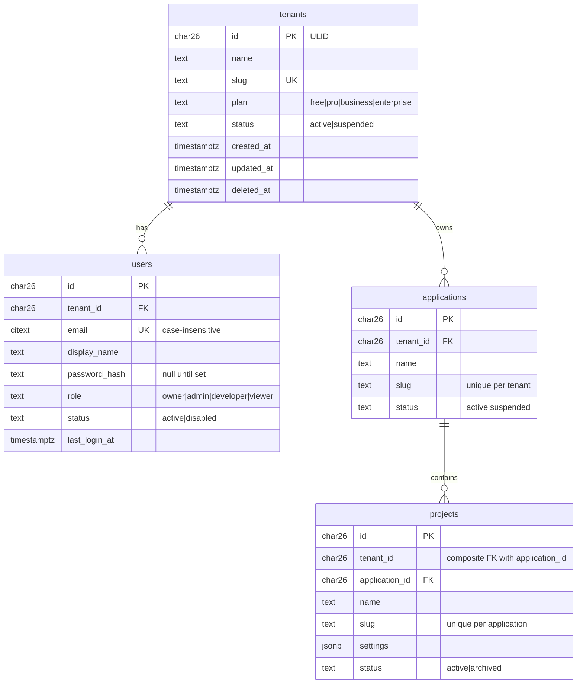

# 01 - Entity Relationship Diagram

> Category: **Database** (`docs/DATABASE/`) &nbsp;|&nbsp; Status: Final (v1 -- grows with each schema task) &nbsp;|&nbsp; Owner: TBD

## Purpose

A diagram of the tables that **exist** -- not the ones planned. Every
migration that adds a table updates this document in the same change.

## Category Mandate

The relational data model underlying assets, tenancy, permissions, usage,
and audit.

---

## Current schema (after `P0-06`)

## Constraints worth seeing

| Constraint | Table | Meaning |
|---|---|---|
| `applications_id_tenant_uk unique (id, tenant_id)` | applications | Target for composite FKs |
| `projects_application_fk (application_id, tenant_id) -> applications (id, tenant_id)` | projects | A project's tenant must equal its application's tenant |
| `projects_id_tenant_uk unique (id, tenant_id)` | projects | Target for composite FKs from every project-owned table (`P1-01`) |
| `users_email_key unique (email)` on `citext` | users | One account per email, case-insensitively |

## Acceptance Criteria

- [x] Reflects exactly the tables and columns the migrations create.

## Open Questions

- Extended by `P1-01` with the asset, derivative, taxonomy, key, usage,
  webhook, and audit tables.

## Related Documents

- `docs/DATABASE/00-DATA-MODEL.md`
- `packages/db/src/migrations/`
